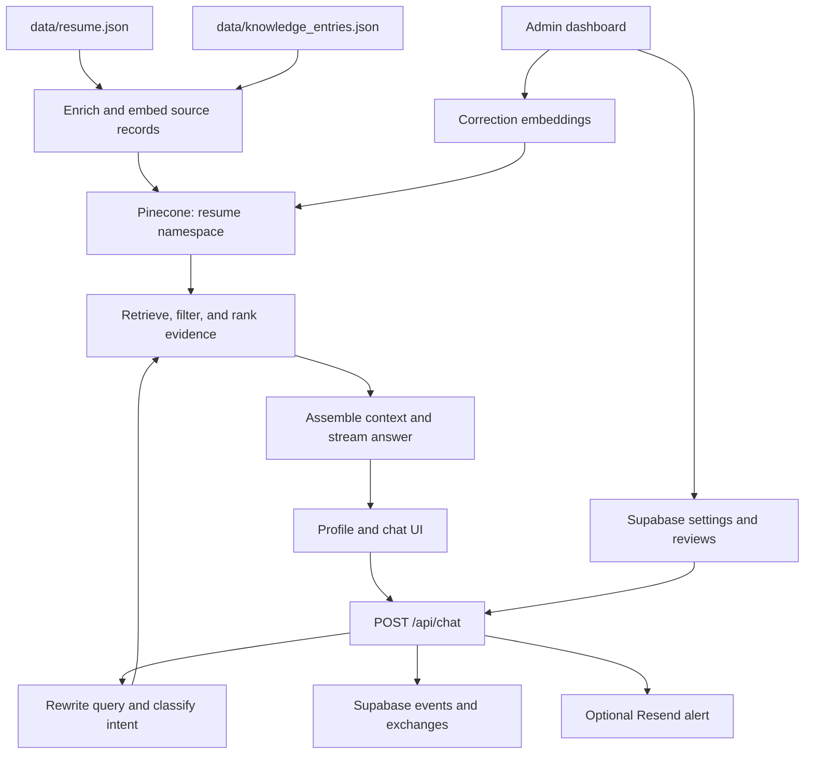

# Ask DJ

An interactive professional profile for Dong Jae Lee. Visitors can explore his career, read work samples, and ask questions in English or Korean. Answers stream from a retrieval-augmented generation (RAG) pipeline grounded in curated career facts and personal stories.

The project combines a resume website, a conversational interface, and an owner workflow for inspecting answers and improving the knowledge base.

## What it does

- **Explore a profile:** career timeline, achievements, portfolio, and a downloadable resume.
- **Ask follow-up questions:** streamed answers, source labels, suggested questions, feedback, and conversation export.
- **Choose a perspective:** recruiting, venture capital, founder/partner, general visitor, or developer partnerships. The selected persona changes retrieval priorities and answer framing.
- **Review quality:** inspect conversations, rate answers, add corrections, and adjust persona visibility, labels, and answer style.
- **Capture experience:** an interview assistant and transcript-processing script turn detailed stories into searchable knowledge.

The current public entry point is `/dj`; `/` redirects there. `/v1` and `/ui` retain earlier versions and design experiments.

## Stack

| Layer | Implementation |
| --- | --- |
| Application | Next.js 16 App Router, React 19, TypeScript |
| Interface | Tailwind CSS 4, Radix UI primitives, Lucide icons, React Markdown |
| AI transport | Vercel AI SDK 6 and its React hooks |
| Text generation | OpenAI; currently configured as `gpt-5.6-terra` in source |
| Embeddings | OpenAI `text-embedding-3-large`, 3,072 dimensions |
| Retrieval | Pinecone, cosine similarity, `resume` namespace |
| Persistence | Supabase for events, conversations, reviews, and settings |
| Notifications | Optional Resend email alerts |
| Hosting integration | Vercel Analytics and `waitUntil` for background writes |
| Local tooling | npm, ESLint, TypeScript, and `tsx` scripts |

These model identifiers describe this checkout. Running AI features requires credentials with access to the configured models.

## Architecture

There are two data paths: an offline path that prepares searchable knowledge and an online path that answers a visitor's question.



### Answer pipeline

The main implementation is [`app/api/chat/route.ts`](app/api/chat/route.ts).

1. Read message history, visitor persona, focus, language, and session metadata. Apply a per-instance request limit.
2. Detect company, section, or time-period references. Rewrite the question for retrieval and classify it as specific, broad, or ambiguous.
3. For an ambiguous question, stream clarifying suggestions without querying Pinecone.
4. Embed the search query. Combine semantic matches, entity-filtered matches, focus matches, and pinned career context. A separate original-question search can identify a close match to a prepared Q&A.
5. Remove persona-suppressed entries and rank candidates by persona and focus priorities. Assemble either a primary answer with supporting evidence or an overview with detailed stories.
6. Build the answer prompt, include recent conversation history, and stream through the AI SDK. Attach source labels as message metadata.
7. Record events and completed exchanges asynchronously. Owner reviews can add correction vectors for subsequent retrieval.

The source-grounding rules are prompt instructions, not a factual verification system. The live evaluator checks retrieval recall rather than the accuracy of every generated answer.

### Content ownership

| Source | Purpose |
| --- | --- |
| [`data/resume.json`](data/resume.json) | Structured career facts and accomplishments |
| [`data/knowledge_entries.json`](data/knowledge_entries.json) | Prepared questions, answer summaries, and detailed stories |
| [`lib/profile-data.ts`](lib/profile-data.ts) | Bilingual profile content and starter questions |
| [`lib/persona-config.ts`](lib/persona-config.ts) | Persona tone, retrieval priorities, focus terms, and suppression rules |
| [`lib/answer-modes.ts`](lib/answer-modes.ts) | Default and pyramid-style answer instructions |
| Pinecone | Embedded source records and owner-created corrections |
| Supabase | Events, exchanges, review status, and runtime settings |

Profile display content and retrieval content are maintained separately. Updating the knowledge JSON requires re-indexing; changing profile text does not update Pinecone. Admin corrections currently live in the remote index and exchange records, not in the source JSON.

### Code map

```text
app/
  dj/                    Public profile and work-sample pages
  admin/                 Dashboard, knowledge capture, internal debugger
  api/                   Chat, feedback, capture, and admin handlers
  ui/                    Prototype gallery and HTML-serving route
  v1/                    Earlier chat interface
components/
  ProfileApp.tsx         Profile state and AI SDK chat integration
  ProfilePanel.tsx       Career and portfolio presentation
  ChatPanel.tsx          Messages, composer, suggestions, PDF export
  TracePanel.tsx         Retrieval and prompt inspection
  ui/                   Reusable UI primitives
lib/                     Domain configuration and service helpers
scripts/                 Ingestion, retrieval evaluation, transcript structuring
public/                  Resume PDF and static assets
data/                    Curated knowledge and archived source material
prompts/                 Historical prompts and architecture notes
ui_test/                 Earlier interface prototypes
```

`prompts/` and prototype documents describe earlier iterations. Executable source and this README describe the current implementation.

## Run locally

Node.js 22 and npm match the environment used to verify this checkout. Dependencies are pinned in `package-lock.json`.

```bash
npm ci
```

Create `.env.local` in the repository root:

```dotenv
# Required for live chat, retrieval, and indexing
OPENAI_API_KEY=your-openai-api-key
PINECONE_API_KEY=your-pinecone-api-key
PINECONE_INDEX_NAME=your-development-index

# Required for intended administrator protection
ADMIN_PASSWORD=choose-a-long-unique-password
ADMIN_SESSION_SECRET=choose-an-independent-long-random-secret

# Optional for public chat; required for persistent admin workflows
SUPABASE_URL=https://your-project.supabase.co
SUPABASE_SERVICE_ROLE_KEY=your-server-side-service-role-key

# Optional: enable new-session email alerts
RESEND_API_KEY=your-resend-api-key
```

Environment files are ignored by Git. All provider credentials remain server-side; none need a `NEXT_PUBLIC_` prefix.

Before enabling persistence, provision the tables expected by the code: `analytics_events`, `chat_exchanges`, and `app_settings`. This checkout **does not yet include a database migration or schema bootstrap**. Credentials alone do not set up a fresh database. [`lib/analytics.ts`](lib/analytics.ts), [`lib/settings.ts`](lib/settings.ts), and the admin handlers define the current field contracts.

Without Supabase configuration, public settings fall back to defaults and persistent conversation/review features are unavailable. Without Resend, alerts are disabled. Before enabling Resend for another deployment, update the sender and recipient in [`lib/email.ts`](lib/email.ts).

Populate a development Pinecone index, then start the app:

```bash
npm run ingest
npm run dev
```

Open [http://localhost:3000/dj](http://localhost:3000/dj). Ingestion creates a missing index with cosine similarity, 3,072 dimensions, and a serverless deployment in AWS `us-east-1`.

**Current ingestion behavior:** `npm run ingest` deletes every vector in the `resume` namespace before uploading the JSON records. This includes admin corrections. Use a development index for setup, and preserve corrections before running it against an existing index. Safe ingestion is a priority in the refactor design.

## Development commands

| Command | Purpose |
| --- | --- |
| `npm run dev` | Start the Next.js development server |
| `npm run build` | Create a production build |
| `npm start` | Serve an existing production build |
| `npm run lint` | Run ESLint |
| `npx tsc --noEmit` | Check TypeScript independently |
| `npm run ingest` | Rebuild the configured Pinecone namespace from source JSON |
| `npm run eval` | Run 12 live retrieval-recall cases |
| `npm run structure -- --input path/to/transcript.txt` | Extract knowledge entries from a transcript |

The data scripts load `.env.local` through `tsx`. Ingestion, evaluation, and structuring make live provider calls and may incur usage charges; they are not an offline test suite.

The structuring script appends generated entries to `data/knowledge_entries.json`; it does not re-index them. Review the diff for factual accuracy and duplicates before indexing. `--skip-dedup` disables the similarity check. The current capture TXT exporter and transcript parser disagree about speaker roles; check interviewer/question and DJ/answer attribution manually until that defect is fixed.

## Routes and owner workflow

| Route | Purpose |
| --- | --- |
| `/dj` | Public profile and streaming chat |
| `/dj/apple-immersive-video` | Apple immersive video work sample |
| `/dj/b2b-saas-km-analysis` | B2B SaaS knowledge-management analysis |
| `/dj/breakout-game-analysis` | Game analysis work sample |
| `/dj/flint-analysis` | Flint retrospective |
| `/admin/dashboard` | Review, metrics, corrections, and persona settings |
| `/admin/internal` | Profile with retrieval and prompt traces |
| `/admin/capture` | Interview assistant for capturing new material |
| `/v1` | Earlier chat interface |
| `/ui`, `/ui/[name]` | Gallery and selected historical interfaces |

The owner workflow is: inspect an exchange, mark it good or needing improvement, and optionally supply a corrected answer. A correction is embedded using the original question and upserted into Pinecone. Persona visibility, bilingual labels, and answer mode are managed in the dashboard.

The current admin implementation uses a shared password. It needs the authentication and trace-access fixes described in the [baseline review](docs/reviews/2026-09-29-codebase-review.md); the internal debugger is not a secure boundary in this revision.

## Deployment and local-only files

Deploy the committed repository as a Node.js Next.js application. Configure the server-side environment variables, provision the data services, and build with `npm run build`. Vercel is the current integration target: the app uses Vercel Analytics and `waitUntil` to keep logging and notifications alive after a response. Other hosts need equivalent background-task lifecycle handling. The build uses Google-hosted Geist fonts through `next/font`.

Deploy from a clean Git checkout. Personal Meta preparation routes, exports, scripts, and notes are intentionally ignored and may remain on a developer's machine. `.gitignore` excludes them from Git; it does not prevent Next.js from building a local route or serving a local `public/` file.

## Quality and refactor status

The [baseline review](docs/reviews/2026-09-29-codebase-review.md) records verified issues and check results. The [proposed refactor design](docs/superpowers/specs/2026-09-29-codebase-refactor-design.md) defines boundaries, compatibility requirements, and acceptance checks.

At baseline, the tracked snapshot passes `npm run build -- --webpack`; the default Turbopack build has not yet been verified. ESLint reports 14 errors and 8 warnings, and there is no checked-in automated test suite or CI workflow. The proposed refactor makes reproducible setup, tested behavior, and clear ownership of code part of the project.
